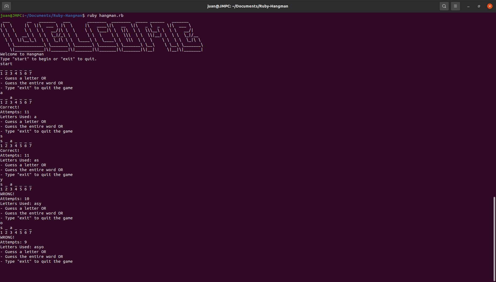

The purpose of this project was to practice programming with ruby

Run the project locally(prerequisites: ruby):

1. Download or clone the repository.
2. Open the terminal inside the root folder and run:

ruby hangman.rb